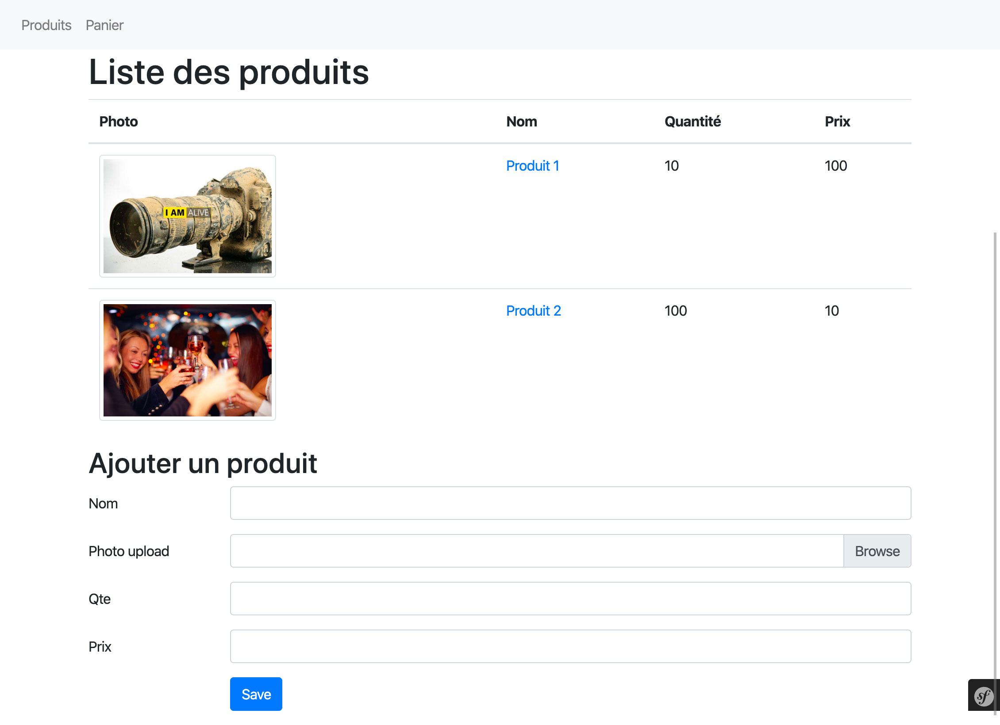
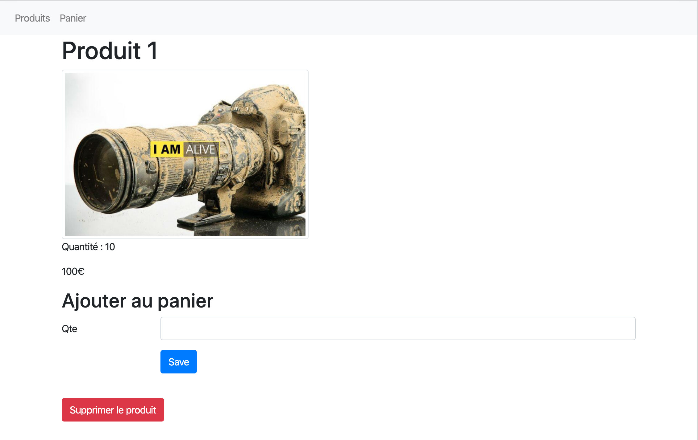
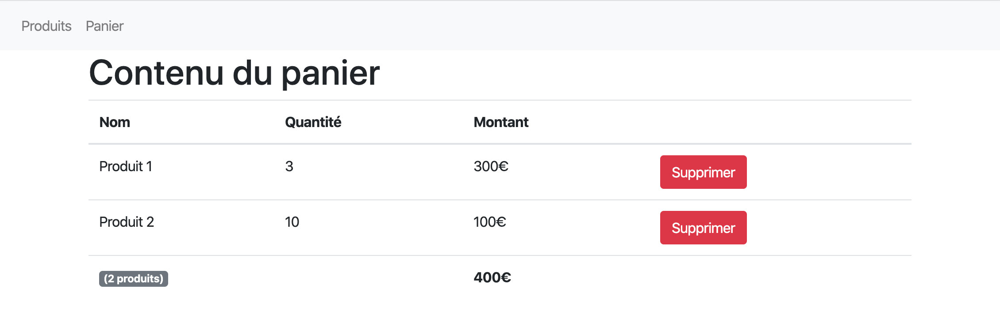

# Evaluation

__Vous devez réaliser un micro site en `Symfony5` permettant d'ajouter des produits à un panier.__

On considère qu'il n'y a qu'un seul panier dans cet exercice.

__Ce devoir est a faire individuellement.__

__Vous avez accès à vos notes, au cours, corrigés d'exercices et à internet mais toute communication verbale ou digitale est interdite.__

Occupez vous prioritairement de Symfony, peu de points seront accordés au design.

L'utilisation de bundles non vus en cours n'est pas autorisé.

Vous avez le droit à 2 jokers, c'est à dire que vous pouvez m'appeler 2 fois pour que je vienne vous débugger.

## Introduction
Vous devez avoir deux entités :
- `produit` qui possède les données suivantes :
	- `nom`,
	- `photo`,
	- `quantité` _(son stock)_,
	- `prix`.
- `panier` qui possède les données suivantes :
	- `produit` _(jointure avec la table produit => __ManyToOne__)_,
	- `quantité` _(quantité commandée)_,
	- `date_ajout` _(datetime d'ajout du produit au panier)_,
	- `etat` _(permet de savoir si le panier à été acheté ou non)_.

## Page PRODUITS
La page produits doit :
- __lister tous les produits__ présents dans la base de données, avec pour chacun :
	- sa `photo`,
	- son `nom`,
	- sa `quantité`,
	- son `prix`.
- posséder un __formulaire permettant d'ajouter un produit__.

Au clic d'un produit, on doit arriver sur sa fiche.

## Page FICHE PRODUIT
La fiche produit doit :
- __afficher__ les informations du produit,
- posséder un __formulaire permettant d'ajouter le produit au panier__. Ce formulaire doit uniquement posséder un champ `quantité` permettant de choisir la quantité à commander. Vous devez forcer le produit a ajouter. Si vous n'y arrivez pas, vous pouvez afficher une liste déroulante avec le choix du produit (mais vous n'aurez pas tous les points)
- posséder un __bouton permettantde supprimer le produit de la base de données__. Lors de la suppression d'un produit, sa photo doit automatiquement être supprimée.

Lors de l'ajout d'un produit au panier, vous devez sauvegarder automatiquement le datetime d'ajout du produit au panier.

## Page PANIER (Accueil)
La page panier doit :
- __lister tous les produits présents dans le panier__, avec pour chacun :
	- son nom,
	- la quantité commandée,
	- le montant de la ligne _(prix du produit * quantité commandée)_,
	- un bouton permettant de __supprimer le produit du panier__.
- afficher :
	- le __nombre de produits présents dans le panier__,
	- le __montant total du panier__.

## Contraintes
1. Votre site doit comporter un __menu sur toutes les pages__ permettant d'accéder rapidement aux pages :
	- produits,
	- panier (accueil).
2. Tous les __textes__ doivent être __traduits en deux langues__ au choix (sauf les données sauvegardées dans la base de données).
3. Tout formulaire doit faire l'objet :
	- d'une __vérification des champs envoyés__,
	- d'un __message indiquant le succès ou les erreurs éventuellement rencontrées__ (les messages d'erreurs par défaut de Symfony suffisent).

## Rendu :
Vous pouvez me rendre votre devoir par Email _(yoann.coualan@gmail.com)_ ou via Github _(yoanncoualan)_ le __dimanche 22 mars 2020__ à __23h59__ au plus tard.

⚠️ 1 point de pénalité sera appliqué par minute de retard !

⚠️ Il ne faut pas inclure dans votre rendu le dossier vendor (il est automatiquement ignoré sur Github).

## Quelques liens utiles
- [Twig](https://twig.symfony.com/)
- [Création de page](https://symfony.com/doc/current/page_creation.html)
- [Controller](https://symfony.com/doc/current/controller.html)
- [Routing](https://symfony.com/doc/current/routing.html)
- [Templates](https://symfony.com/doc/current/templates.html)
- [Doctrine](https://symfony.com/doc/current/doctrine.html)
- [Evenements Doctrine](https://symfony.com/doc/current/doctrine/events.html)
- [Formulaires](https://symfony.com/doc/current/forms.html)
- [Validation des formulaires](https://symfony.com/doc/current/validation.html)
- [Upload d'images](https://symfony.com/doc/current/controller/upload_file.html)

## Quelques captures d'exemple

### Page PRODUITS :

### Page FICHE PRODUIT :

### Page PANIER (Accueil) :

